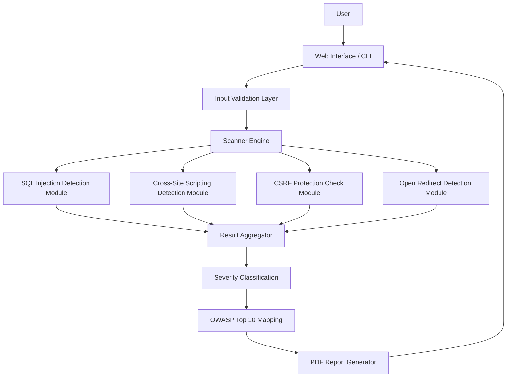

## 🏗️ Overall System Architecture



<div align="center">

# **OverTheWire Wargame Walkthroughs**

A structured and professionally documented collection of walkthroughs for the **OverTheWire** cybersecurity wargames.  
Focused on clarity, accuracy, and long-term learning value.

---


---

### **Wargame Index**

| Wargame | Directory | Status |
|--------|-----------|--------|
| **Bandit** | [`/Bandit`](./Bandit) | ✔ Available |
| **Leviathan** | [`/Leviathan`](./Leviathan) | ⏳ In Progress |
| **Narnia** | [`/Narnia`](./Narnia) | ⏳ In Progress |
| **Krypton** | [`/Krypton`](./Krypton) | ⏳ In Progress |

</div>

---

## **Overview**

This repository provides **clean, structured, and technically accurate walkthroughs** for the OverTheWire wargames.  
The goal is to help learners:

- Understand the *reasoning* behind each step  
- Build a solid foundation in Linux, security concepts, and problem-solving  
- Develop the mindset required for CTFs and real-world cybersecurity tasks  

Each walkthrough is created with an emphasis on:

- Clear explanations  
- Reproducible commands  
- Educational breakdowns  
- No shortcuts, no guesswork  

---

## **Purpose**

OverTheWire is one of the most recommended starting points for aspiring cybersecurity professionals.  
This repository exists to:

- Document personal progress  
- Provide high-quality references for others  
- Maintain an open-source learning resource  
- Encourage ethical, hands-on security practice  

It is designed with the standards of documentation used in professional open-source projects.

---

## **Learning Outcomes**

| Area | Description |
|------|-------------|
| **Linux Fundamentals** | Shell navigation, file handling, permissions, processes |
| **Enumeration Techniques** | Searching, filtering, decoding, hidden files |
| **Privilege Mechanics** | SUID/SGID, ownership, execution rights |
| **Basic Cryptography** | Encodings, classic ciphers, data transformations |
| **Binary Interaction** | Executables, permissions, basic debugging logic |

---

## **Getting Started**

To begin with **Bandit Level 0**, use:

```bash
ssh bandit0@bandit.labs.overthewire.org -p 2220
# Password: bandit0
